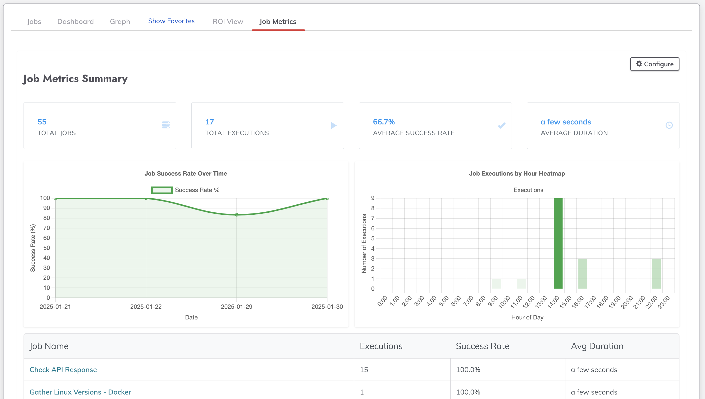

# Job Metrics Plugin for Rundeck

**Transform your job execution data into actionable insights**

The Job Metrics plugin provides comprehensive visualization and analysis of your Rundeck job execution patterns, success rates, and timing trends through an intuitive dashboard interface.


*Job Metrics Dashboard showing summary stats and charts*

## Versions

Current Stable Version: 1.0.0

| Plugin Version | Rundeck Version | Release Date |
|----|----|----|
| 1.0.0    | 5.0.0+    | 2024-01-29   |

## Key Features

- **Dynamic Metrics Dashboard**: Real-time view of execution statistics across all jobs
- **Interactive Success Rate Tracking**: Visual trends of job success rates over time
- **Time-of-Day Analysis**: Heat map showing execution patterns throughout the day
- **Flexible Time Windows**: Customize analysis periods to match your needs
- **Sortable Job Lists**: Easy filtering and sorting by various metrics

## Visualizations

- **Success Rate Chart**: Track success rates over time with intuitive line graphs
- **Time Heat Map**: Identify peak execution times with color-coded hourly distributions
- **Job List View**: Comprehensive metrics for all jobs including:
  - **Total Executions**: Total count of all job runs within the selected time window
  - **Success Rate**: Percentage calculated as (successful executions / total executions) × 100
    - Only considers jobs with at least one execution
    - Jobs with zero executions are excluded from the average
  - **Average Duration**: Mean execution time calculated as (sum of all execution durations / number of executions)
    - Displayed in human-readable format (e.g., "2 minutes", "1 hour")
    - Based on actual run times from start to completion
  - **Failure Count**: Total number of executions with status other than 'succeeded'
    - Includes both failed and aborted executions
    - Used to identify problematic jobs needing attention

## Business Benefits

- Identify problematic jobs with low success rates
- Optimize scheduling by understanding execution patterns
- Make data-driven decisions about job configurations
- Track performance trends over time
- Quickly spot anomalies in job execution patterns

## Requirements

- Rundeck version 5.0.0 or higher
- Modern web browser with:
  - JavaScript enabled
  - localStorage enabled
  - Canvas support for charts
- Project-level access to view job executions

## Configuration

The plugin supports configuration through a UI settings button:
- Click the Configure button in the Job Metrics view
- Adjust the Time Window value (in days)
- Settings are saved per user via browser localStorage
- Changes take effect immediately

Default values:
- Time Window: 10 days

## Usage

1. Navigate to the Jobs page in Rundeck
2. Look for the "Job Metrics" tab
3. View the summary metrics at the top of the page
4. Analyze execution patterns in the charts
5. Sort the job list by clicking column headers
6. Adjust the time window using the Configure button

## Build

Using gradle:

```bash
./gradlew clean build
```

## Install

```bash
cp build/distributions/ui-jobmetrics-1.0.0.zip $RDECK_BASE/libext
```

Changes to this setting take effect on the next page load without requiring a restart.

## Known Issues/Limitations

- Time window settings are stored in browser localStorage and don't persist across different browsers/devices
- Charts require browser support for Canvas
- Historical data limited by Rundeck's execution history retention settings

## Support

- Issues: Please report any issues via the GitHub repository as this plugin is Community Supported only.